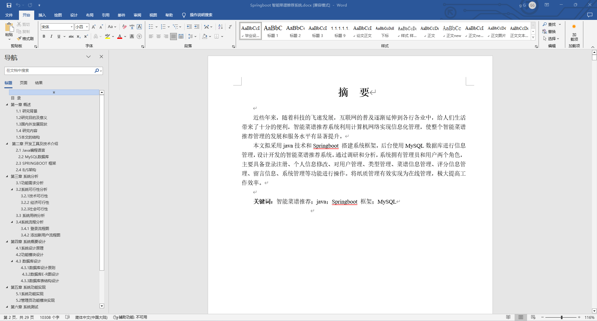
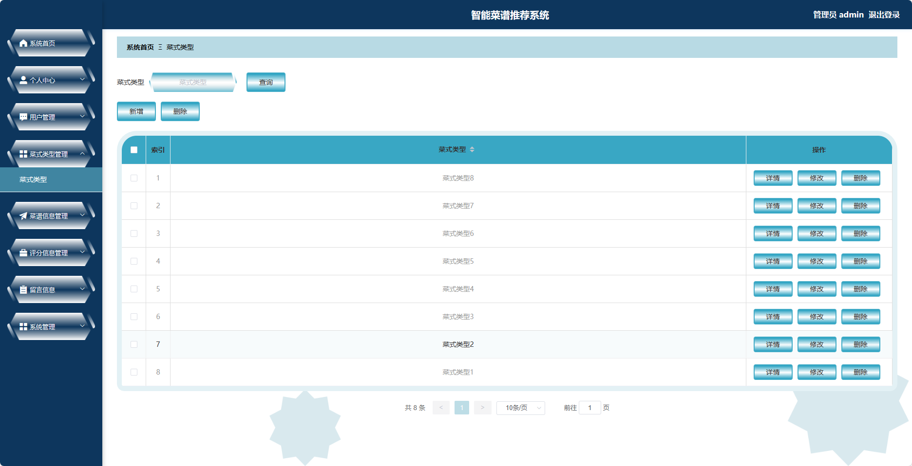
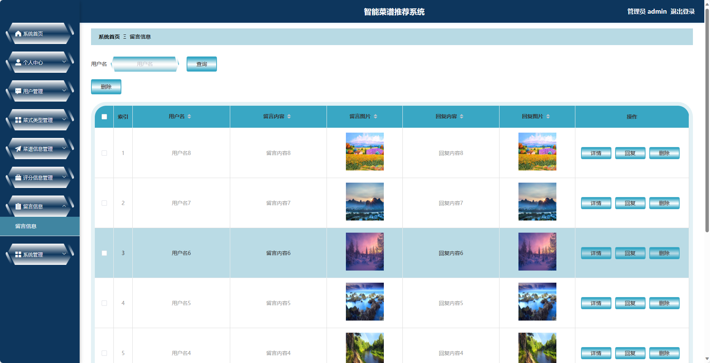

基于Springboot框架实现的智能菜谱推荐系统(程序+论文)
=
###  完整代码获取地址：从戎源码网 ([https://armycodes.com/](https://armycodes.com/))
###  作者微信：19941326836  QQ：952045282 
###  承接计算机毕业设计、Java毕业设计、Python毕业设计、深度学习、机器学习
###  选题+开题报告+任务书+程序定制+安装调试+论文+答辩ppt 一条龙服务
###  毕业设计所有选题地址:(https://github.com/3212618475/allProject)

一、项目介绍
---
基于Spring Boot框架实现的智能菜谱推荐系统，系统包含两种角色：管理员、用户,系统分为前台和后台两大模块，主要功能如下。
### 前台:
- 首页：展示平台的最新动态、推荐菜谱等内容。
- 菜谱信息：用户可以浏览各类菜谱。
- 公告信息：展示平台发布的公告和通知信息。
- 留言信息：用户可以在留言板上进行留言和评论。
- 个人中心：用户可以管理个人信息，包括修改密码、查看收藏的菜谱等。

### 后台
### 管理员:
- 个人中心：管理员可以管理个人信息，修改密码等。
- 用户管理：管理员可以管理用户信息，包括添加、编辑和删除用户信息。
- 菜式类型管理：管理员可以管理菜式的分类信息，包括添加、编辑和删除分类。
- 菜谱信息管理：管理员可以管理菜谱的信息，包括添加、编辑和删除菜谱。
- 评分信息管理：管理员可以管理用户对菜谱的评分信息，包括查看和删除评分。
- 留言信息：管理员可以管理留言和评论，包括删除不当内容。
- 系统管理：管理员可以管理系统的相关配置，包括日志管理、权限管理等。
  
### 用户:
- 个人中心：用户可以管理个人信息。
- 宿舍安排管理：用户可以查看和管理宿舍的分配情况。
- 报修信息管理：用户可以提交和查看报修信息。
- 报修处理管理：用户可以查看和处理报修请求。
- 假期留宿管理：用户可以申请和查看假期留宿的相关信息。
- 卫生检查管理：用户可以查看卫生检查相关的信息。
- 文明宿合管理：用户可以查看和管理文明宿舍合规性。
- 缴费信息管理：用户可以查看和管理缴费信息。
- 桶装水预订管理：用户可以预订和管理桶装水的订单。
- 失物信息管理：用户可以发布和管理失物信息。
- 招领信息管理：用户可以发布和管理招领信息。
- 我的收藏管理：用户可以查看和管理自己的收藏信息。

### 用户
- 个人中心：用户可以管理个人信息，包括修改密码、查看评分历史等。
- 评分信息管理：用户可以对菜谱进行评分。

二、项目技术
---
编程语言：Java
数据库：MySQL
项目管理工具：Maven
前端技术：Vue
后端技术：SpringBoot

三、运行环境
---
操作系统：Windows、macOS都可以
JDK版本：JDK1.8以上都可以
开发工具：IDEA、Ecplise、Myecplise都可以
数据库: MySQL5.7以上都可以
Tomcat：任意版本都可以
Maven：任意版本都可以

四、项目截图
---
文档截图

使用截图

